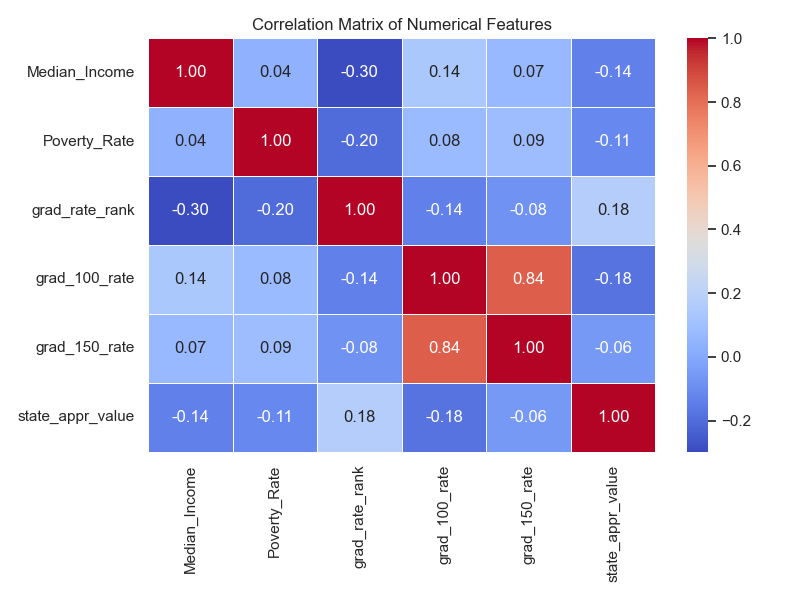
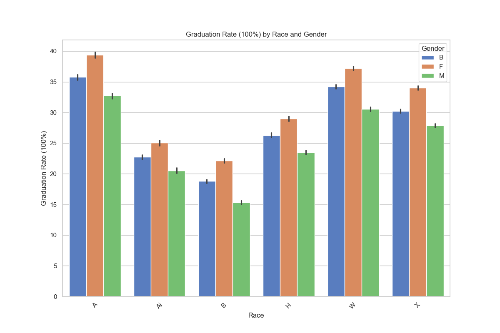
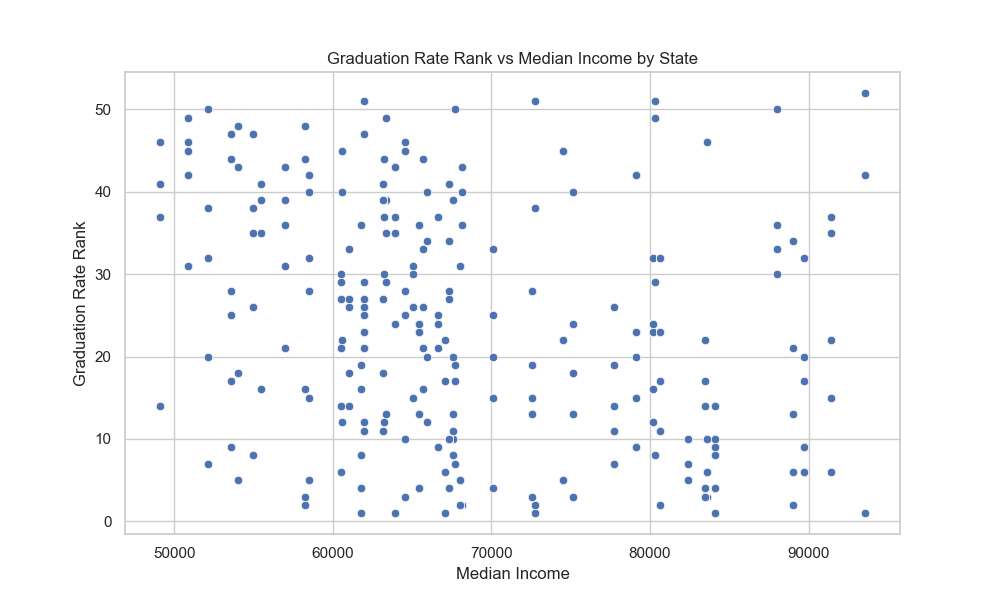
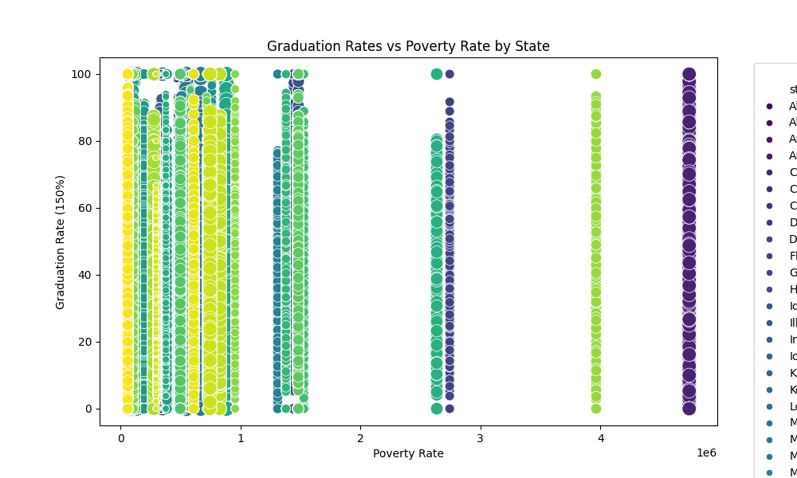
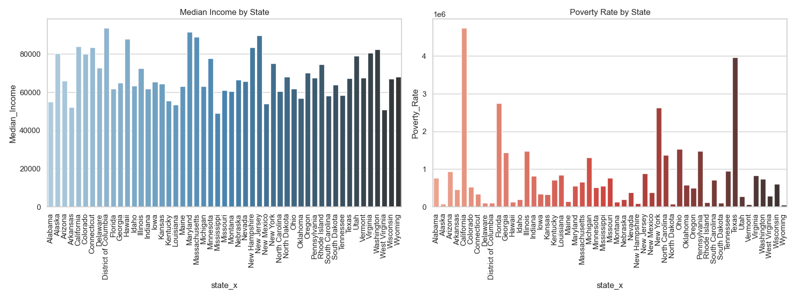
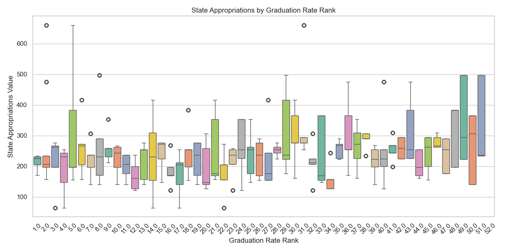

# Socioeconomic Factors and Education Outcomes

## Link to Archival Record
[Link to Archived Copy](https://sandbox.zenodo.org/records/141346)

## Link to Box with Output Files
[Link to Box](https://uofi.box.com/s/9rvz4s02pyr8dbpzak3p0am0rg9mrnrl)

## Contributors
- Natasha Nangia
- Richa Basarkar
- Evelina Astranskas

## Summary

Throughout the United States, public school education exists to provide all children with a form of education despite the different socioeconomic classes they come from. However, this apparent equality of education among students across the US still struggles with inequitities as life within different socioeconomic brackets can still result in different educational outcomes for students. For example, access to private tutors and personalized help is not widely accessible to each student in the country. Additionally, regional factors can contribute to these differences due to inconsistencies in the standard of living among different regions of the United States.

The goal of our project is to analyze the relationship between socioeconomic factors and education outcomes across different regions of the United States. By integrating data on socioeconomic indicators from the U.S. Census Bureau with education statistics from the National Center for Education Statistics (NCES), we aim to uncover patterns and correlations that may reveal how factors like income and employment impact educational achievements, specifically graduation rates from higher level education. 

The analysis aims to answer the following research question(s):
1. How do socioeconomic factors (e.g., income, poverty rates, employment) influence education outcomes (e.g., graduation rates, test scores) across different U.S. regions?
2. Are there regional patterns in how socioeconomic factors correlate with educational achievements, and what might these patterns indicate about resource allocation or policy needs?

The findings are supported by multiple different visualizations, including, but not limited to, a correlation matrix and scatter plots.

## Data Profile

### Datasets Used

#### 1. Poverty Statistics: ACS (API Data)
This dataset, sourced from the **American Community Survey (ACS)** conducted by the **U.S. Census Bureau**, provides comprehensive insights into socioeconomic demographics. Key variables include:
- Total population and number of children in poverty.
- Median household income.
- Geographical regions with high poverty rates.
- Race-specific socioeconomic factors, including mixed-race demographics.

The dataset allows for an in-depth analysis of how poverty and income disparities influence education outcomes. We also integrate **Small Area Income and Poverty Estimates (SAIPE)**, which help identify critical patterns in poverty distribution and related variables. Additional variables may be incorporated as the project progresses.

**Source**: [American Community Survey (ACS)](https://www.census.gov/programs-surveys/acs)

---

#### 2. College Completion Data Set (Non-API Data from Kaggle.com)
This dataset consists of four subsets of data detailing college completion rates and graduate demographics across U.S. regions. Key features include:
- University attributes, such as cohort size, public/private status, flagship status, and Historically Black Colleges and Universities (HBCUs).
- Demographics of graduates, including race, gender, and age.
- Graduation rates within specific timeframes (e.g., 100% and 150% of program duration).

The dataset was originally compiled by **Jonathan Ortiz** and draws from two primary sources:
1. **NCES Integrated Postsecondary Education System (IPEDS)**
2. **Voluntary System of Accountability’s Student Success and Progress Rate**

Analyzing this data provides insights into how higher-education pathways vary based on socioeconomic backgrounds. Additionally, it highlights regional disparities and time-based comparisons for university completion rates. The college completion data sets consisted of 4 subsets. Within those subsets of data, we used the state sector details and state sector grad subsets. Though there were 4 datasets, the other two datasets either consisted of data that was repeated in the utilized subsets or was not relevant to the goals of this analysis.

**Source**: [Kaggle: College Completion Dataset](https://www.kaggle.com/)

---

### Data Cleaning and Integration
1. **Merging Data**:
   - The poverty dataset from ACS is joined with the college completion dataset using state-level identifiers (`stateid`).
   - Relevant columns [Median_Income,  Poverty_Rate,  grad_rate_rank,  grad_100_rate,  grad_150_rate,  state_appr_value,  state_appr_rank, gender, race,  state_x] are extracted for analysis, focusing on socioeconomic, education, and regionally-related variables.

2. **Licensing**:
   - The ACS dataset is publicly available via the U.S. Census Bureau.
   - The Kaggle dataset is open for non-commercial research and educational purposes.

3. **Tools Used**:
   - **Python Libraries**: Pandas for merging and cleaning, Matplotlib and Seaborn for visualizations.

## Findings

### Key Visualizations and Insights

1. **Correlation Matrix**:
   - The correlation matrix highlights relationships between socioeconomic factors and educational outcomes.
   - **Median Income** shows a slight positive correlation with graduation rates (`grad_100_rate` and `grad_150_rate`).
   - **Poverty Rate** is negatively correlated with graduation rates, suggesting a connection between socioeconomic disadvantage and lower educational attainment.
   - **State Appropriations Rank** is inversely correlated with appropriations value, indicating that lower-ranked states receive higher funding.

   

---

2. **Graduation Rates by Race and Gender**:
   - Graduation rates vary significantly by race and gender. For example:
     - White (W) and Asian (A) students show the highest graduation rates across genders.
     - Black (B) and Hispanic (H) students tend to have lower graduation rates, highlighting potential disparities.
   - Gender differences are minor but consistent, with females often outperforming males in most racial categories.

   

---

3. **Graduation Rate Rank vs. Median Income**:
   - The scatter plot illustrates a general trend where higher median income is associated with better graduation rate ranks.
   - However, variability exists, indicating that other factors (e.g., state policies, funding) also play a significant role.

   

---

4. **Graduation Rates vs. Poverty Rate**:
   - Graduation rates tend to decline as poverty rates increase.
   - States with extreme poverty rates show the lowest graduation outcomes, reflecting the profound impact of socioeconomic challenges on education.

   

---

5. **Median Income and Poverty Rate by State**:
   - The bar charts display median income and poverty rates by state.
   - States with the highest median incomes (e.g., Maryland, Massachusetts) have significantly lower poverty rates.
   - Conversely, states like Mississippi and Louisiana show lower median incomes and higher poverty rates.

   

---

6. **State Appropriations by Graduation Rate Rank**:
   - The box plot shows how state appropriations vary with graduation rate rank.
   - States with higher graduation rate ranks tend to have higher state appropriations, but variability exists, particularly for middle-ranked states.

   

---

### Summary of Findings
- **Socioeconomic Disparities**: States with higher median incomes and lower poverty rates consistently exhibit better educational outcomes.
- **Racial and Gender Disparities**: Graduation rates reveal inequities, particularly for Black and Hispanic students.
- **Funding and Education**: Higher state appropriations are loosely correlated with improved graduation rate ranks, suggesting the importance of resource allocation.

These findings provide critical insights into how socioeconomic and demographic factors influence educational success, guiding potential policy interventions. As visualized through the charts and graphs, states that tend to have higher median incomes–which typically imply lower poverty rates– consistently demonstrated higher graduation rates from higher education. This could be due to the access to resources for students in higher income households and/or states.

Additionally, the juxtaposition between race and educational outcomes was also analyzed. The results showcased that people of color (Black and Hispanic students) typically had lower graduation rates. This could be due to numerous reasons including, but not limited to, the historical and systematic issues that people of color have had to face within the United States. 


## Future Work

### Lessons Learned
This project highlighted the complexity of analyzing socioeconomic factors and their impact on educational outcomes. Key takeaways include:
1. **Data Availability and Integration**:
   - Access to detailed, high-quality datasets is essential for deriving meaningful insights.
   - Integrating datasets from multiple sources (e.g., poverty statistics and education data) requires careful handling of identifiers and consistent formatting.
2. **Impact of Socioeconomic Disparities**:
   - The significant disparities in graduation rates across racial and socioeconomic groups reveal the importance of addressing structural inequalities.
   - States with higher poverty rates consistently lag in educational outcomes, underscoring the need for targeted policies and funding allocation.
3. **Role of Data Visualization**:
   - Visualizations provided a clear way to identify trends and correlations that may not be immediately evident from raw data.
   - For example, scatter plots and box plots revealed how socioeconomic factors like income and poverty rates correlate with educational attainment and funding distribution.

### Potential Future Work
To extend and improve upon this analysis, future research could focus on the following areas:

#### 1. Incorporating Additional Variables
   - **Geographical Factors**: Include rural vs. urban classifications to analyze how location influences educational outcomes.
   - **State Education Budgets**: Examine how state-level education spending (e.g., per-student funding) correlates with outcomes like graduation rates and test scores.
   - **Family and Household Dynamics**: Consider family size, single-parent households, and parental education levels to understand their influence on student success.

#### 2. Expanding to Time-Series Analysis
   - Analyzing trends over multiple years would help identify whether disparities in educational outcomes are improving or worsening over time.
   - Investigate how changes in state policies (e.g., increased appropriations or targeted interventions) affect graduation rates and poverty levels over a decade.

#### 3. Machine Learning for Predictive Modeling
   - Develop predictive models to forecast educational outcomes based on socioeconomic indicators.
   - Machine learning techniques such as regression analysis or classification models could help identify high-risk groups or regions needing intervention.
   - For instance, predict which states or demographics are most at risk for low graduation rates given current poverty and income statistics.

## Reproducing the Results

To reproduce the results of this project, follow the steps below:

### 1. Clone the Repository
Download the repository to your local machine:
```bash
git clone <https://github.com/illinois-data-curation/is477-fa24-TEAM_REN>
cd <is477-fa24-TEAM_REN>
```
### 2. Set up the python environment
```bash
python3 -m venv env
source env/bin/activate
```
### 3. Install Dependencies
```bash
pip install -r requirements.txt
```
### 4. Run the Snakemake Workflow
```bash
snakemake --cores 1
```
### 5. Outputs
The workflow will generate the following outputs:

#### Cleaned Data:
- The cleaned dataset will be saved in the `data` folder:
  - `cleaned_state_data.csv`

#### Visualizations:
- Visualizations will be saved in the `visualizations` folder:
  - `correlation_matrix.png`: Displays correlations between socioeconomic factors and graduation outcomes.
  - `graduation_rate_by_race_gender.png`: Shows graduation rates broken down by race and gender.
  - `graduation_rate_vs_income.png`: Scatter plot of graduation rate rank vs. median income by state.
  - `graduation_rate_vs_poverty.png`: Scatter plot of graduation rates vs. poverty rate by state.
  - `income_poverty_by_state.png`: Bar charts of median income and poverty rate by state.
  - `state_appropriations_by_grad_rank.png`: Box plot of state appropriations vs. graduation rate rank.

---

### 6. Verify the Outputs
After running the workflow, verify the following:

1. **Cleaned Data**:
   - Ensure the file `cleaned_state_data.csv` exists in the `data` folder and contains the expected columns and data.

2. **Visualizations**:
   - Check the `visualizations` folder for all six `.png` files.
   - Open each file to confirm the visualizations match the project specifications.

## References

1. **American Community Survey (ACS):**  
   - U.S. Census Bureau. "American Community Survey (ACS)."  
   - Available at: [https://www.census.gov/programs-surveys/acs](https://www.census.gov/programs-surveys/acs).  
   - Accessed for poverty statistics and socioeconomic data.

2. **Small Area Income and Poverty Estimates (SAIPE):**  
   - U.S. Census Bureau. "Small Area Income and Poverty Estimates (SAIPE)."  
   - Available at: [https://www.census.gov/programs-surveys/saipe.html](https://www.census.gov/programs-surveys/saipe.html).  
   - Accessed for income and poverty data at the state level.

3. **College Completion Dataset:**  
   - Ortiz, Jonathan. "College Completion Rates Dataset."  
   - Source: Kaggle.  
   - Available at: [https://www.kaggle.com/datasets/jonathanpaulson/college-completion](https://www.kaggle.com/datasets/jonathanpaulson/college-completion).  
   - Dataset includes graduation rates, demographics, and institutional information.

4. **Python Libraries:**  
   - Pandas: McKinney, Wes. *Python for Data Analysis*. O'Reilly Media, 2017.  
   - Matplotlib: Hunter, J. D. "Matplotlib: A 2D graphics environment." *Computing in Science & Engineering*, 2007.  
   - Seaborn: Waskom, M. L. "Seaborn: statistical data visualization." *Journal of Open Source Software*, 2021.  

5. **Software Tools Used:**  
   - Python 3.11: [https://www.python.org/](https://www.python.org/)  
   - VS Code: [https://code.visualstudio.com/](https://code.visualstudio.com/)  
   - GitHub: Repository hosting and version control.
